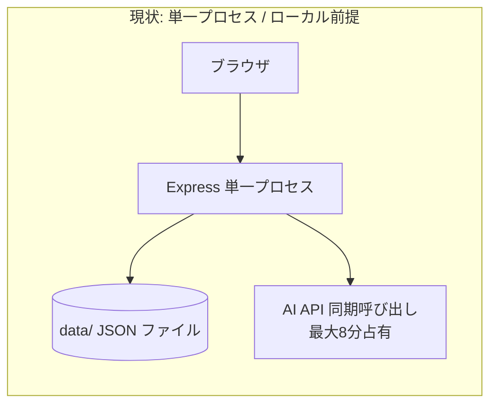
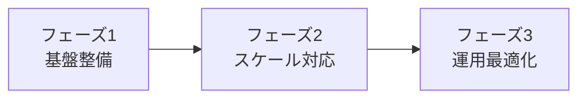

# 改修案 — STEP学習問題作成ツールの外部サービス化に向けて

## 1. ドキュメントの位置づけ

本書は、本ツールを「外部サービスの提供サービスの一部」として利用する場合に想定される改修ポイントを整理したものである。現状はローカル単一プロセス・無認証・ファイル永続化を前提とした個人開発構成であり、サービス化には複数の構造的な改修が必要になる。

- 関連：[要件定義書.md](要件定義書.md) / [画面設計書.md](画面設計書.md) / [詳細設計書.md](詳細設計書.md)
- 本書は「現状の課題 → 改修方針 → 優先度」の形で整理する。具体的な実装はチームでの設計判断に委ねる。

---

## 2. 現状アーキテクチャの限界（サマリ）

| 観点 | 現状 | サービス化での問題 |
| --- | --- | --- |
| 認証・認可 | なし | 誰でも全データ・全機能にアクセス可能 |
| 永続化 | ローカル JSON | マルチインスタンスで共有不可・不整合 |
| 排他制御 | なし | 同時書き込みでデータ消失（後勝ち） |
| 長時間処理 | 同期占有（最大 8 分） | 同時生成でワーカー枯渇・タイムアウト |
| マルチテナント | 概念なし | 利用者・組織ごとのデータ分離ができない |
| セキュリティ | AI 生成 HTML を `innerHTML` | XSS リスク |
| 配信 | Express が静的配信 | スケール時に非効率 |
| 監視・運用 | console.error のみ | 障害検知・追跡が困難 |

---

## 3. 改修ポイント詳細

### 3.1 認証・認可の導入【最優先】

**現状の課題**

- ログイン認証が一切なく、サーバーにアクセスできれば誰でもコース生成・削除・判定が可能。
- 受講生・教材作成者・運用者のロール分離がない（[要件定義書.md](要件定義書.md) 第 4 章）。

**改修方針**

- 認証基盤の導入（例：OAuth2 / OIDC、SaaS なら IdP 連携、または自前のセッション/JWT）。
- ロールベースアクセス制御（RBAC）：
  - 受講生：コース閲覧・自分の進捗更新・判定実行のみ。
  - 教材作成者：コース生成・再生成・削除。
  - 管理者：全操作・他ユーザーの進捗参照。
- API ごとの認可チェックをミドルウェア化（`/api/courses` 系の破壊的操作は作成者以上に限定）。

**影響範囲**：`server.js` 全エンドポイント、フロントのログイン導線、データモデルへの所有者情報付与。

---

### 3.2 永続化層の置き換え（DB / オブジェクトストレージ）【最優先】

**現状の課題**

- `data/` 配下の JSON を直接読み書き（`lib/dataStore.js`）。複数プロセス・複数台で共有されず不整合。
- スクリーンショットはメモリのみ（永続化なし）で、提出履歴・再判定の証跡が残らない。

**改修方針**

- コース・一覧・進捗を RDB（例：PostgreSQL / RDS）へ移行。
  - テーブル例：`courses` / `steps` / `criteria` / `progress` / `users` / `submissions`。
- `lib/dataStore.js` の `loadXxx/saveXxx` をリポジトリ層（DB アクセス）に置き換え、インターフェースは維持して呼び出し側の変更を最小化。
- 教材本文の大きな HTML や提出画像はオブジェクトストレージ（例：S3）へ。
- 組み込みコースの「特別 ID（`aws-level1-default`）＋別ファイル」という分岐は、DB 上の `builtin` フラグに統一。

**影響範囲**：`lib/dataStore.js`、各 API、進捗自動移行ロジック、デプロイ構成。

---

### 3.3 データ競合（排他制御）の解消【高】

**現状の課題**

- `loadCourseIndex → push → saveCourseIndex` など read-modify-write に排他制御がなく、同時実行で一方の更新が失われる（`server.js` のコメントにも明記）。
- `progress.json` 全体を読み書きするため、別コースの同時更新でも競合する。

**改修方針**

- DB 化に伴いトランザクション・行ロック・楽観ロック（バージョン列）で原子性を担保。
- 一覧は「コーステーブルからの集約」に変え、`index.json` のような集約ファイルの再書き込みをなくす。
- 進捗は `(courseId, stepId)` 単位の UPSERT にし、全体ファイル書き換えを廃止。

---

### 3.4 長時間処理の非同期化（ジョブキュー）【高】

**現状の課題**

- コース生成はAI呼び出し（最大 8 分）で Express の 1 ワーカーを同期占有（`server.js` のコメントに明記）。同時生成が増えるとワーカー枯渇・リバースプロキシのタイムアウトを招く。

**改修方針**

- 生成リクエストは受領時に即 `202 Accepted` ＋ジョブ ID を返し、生成はワーカー（キュー）で非同期実行。
  - キュー例：BullMQ（Redis）/ SQS + Lambda / 専用ワーカープロセス。
- 進捗通知は既存の SSE（`lib/progressEvents.js`）を、複数インスタンス間で共有できる方式（Redis Pub/Sub など）に拡張。
- ジョブ状態（pending/running/done/failed）を DB に保持し、リロードや別タブからも参照可能にする。

**影響範囲**：`POST /api/courses/generate` / `regenerate`、`progressEvents.js`、フロントのポーリング/SSE 処理。

---

### 3.5 マルチテナント・データ分離【高】

**現状の課題**

- すべてのコース・進捗がグローバルに共有され、利用者・組織ごとの分離がない。
- 進捗は「コース×STEP」単位で、ユーザーの区別がない（全員の判定結果が混在しうる）。

**改修方針**

- データモデルに `tenantId`（組織）・`userId`（受講生）を導入。
- 進捗を `(userId, courseId, stepId)` 単位に変更し、受講生ごとに独立管理。
- コースの公開範囲（全体／組織内／個人）を制御できるようにする。

---

### 3.6 セキュリティ強化（XSS・入力検証）【高】

**現状の課題**

- AI 生成の `goalHtml` / `detailHtml` をフロントで `innerHTML` 描画（`public/app.js` の `renderStep`）。悪意ある `.md` 入力経由で XSS が成立しうる。
- 入力検証は最小限（`markdown` 空チェック等）。アップロード画像の MIME 検証はフロント依存。

**改修方針**

- サーバー側で生成 HTML をサニタイズ（許可タグを `p/ul/ol/li/table/pre/code` 等に限定するホワイトリスト方式、例：DOMPurify 相当をサーバーで適用）。
- フロントは `innerHTML` を避け、サニタイズ済み HTML のみ描画、もしくは構造化 JSON ＋テンプレートで描画。
- アップロード画像のサーバー側 MIME・サイズ・枚数の再検証。
- 各 API の入力スキーマ検証（例：zod / JSON Schema）。
- レート制限（生成・判定の濫用防止）と CSRF 対策（Cookie セッション採用時）。

---

### 3.7 配信・スケール構成【中】

**現状の課題**

- Express が静的ファイル（`public/`）も配信。スケール時に非効率（`server.js` のコメントにも切り出し方針が記載済み）。

**改修方針**

- 静的アセットは CDN（例：CloudFront）/ 静的ホスティングへ切り出し、Express は `/api/*` 専用にする。
- サーバーをステートレス化（セッション・進捗を外部ストアへ）し、水平スケール（複数インスタンス＋ロードバランサ）可能にする。
- AI 呼び出しのコネクション数・同時実行を制御（同時実行上限・バックプレッシャ）。

---

### 3.8 AI コスト・モデル運用【中】

**現状の課題**

- モデルがコード固定（`gemini-2.5-flash-lite` / `claude-haiku-4-5` / `gpt-5-mini`）で、`.env` 切り替え不可。
- 利用量・コストの可視化がない。提出画像枚数・トークン消費が利用者依存。

**改修方針**

- モデル・パラメータを設定（DB / 環境変数）で切り替え可能にし、用途別（生成は高精度・判定は安価など）に最適化。
- テナント／ユーザー単位の利用量・コストの計測とクォータ（上限）設定。
- API キーをテナントごとに分離（BYOK：Bring Your Own Key）できる構成も検討。
- 生成結果のキャッシュ（同一 `.md` の再生成抑制）でコスト削減。

---

### 3.9 監視・ロギング・運用【中】

**現状の課題**

- エラーは `console.error` のみ。障害検知・追跡・監査ログがない。
- デバッグ用 AI 応答は `data/debug-last-course-response.<provider>.txt` に直前 1 回分のみ上書き。

**改修方針**

- 構造化ログ（リクエスト ID 付与）＋集約基盤（例：CloudWatch / Datadog）。
- メトリクス（生成成功率・判定レイテンシ・AI エラー率）とアラート。
- 監査ログ（誰がいつコースを生成・削除・判定したか）。
- ヘルスチェックエンドポイントの追加。

---

### 3.10 教材生成品質の安定化【中】

**現状の課題**

- AI 出力にブレがあり、JSON 解釈失敗・出力上限切れ・判定基準の架空項目混入（README の比較検証参照）が起こりうる。
- 救済として寛容パーサー（`tolerantJsonParse`）に依存している。

**改修方針**

- 構造化出力（JSON モード / Function Calling / レスポンススキーマ指定）への移行で `tolerantJsonParse` 依存を低減。
- 生成結果に対する自動検証（判定基準が教材本文に根拠を持つかのチェック）と、教材作成者によるレビュー・編集機能。
- 大きな教材の分割生成（STEP 単位の逐次生成）で出力上限切れを回避。

---

### 3.11 API 設計の整理【低〜中】

**現状の課題**

- 生成・再生成が別エンドポイントで重複ロジックがある。
- 進捗が「最新配列を都度上書き保存」する設計で、部分更新に向かない。

**改修方針**

- RESTful な整理（コースのリソース設計、判定結果・提出物のサブリソース化）。
- API バージョニング（`/api/v1/...`）の導入。
- OpenAPI（Swagger）による API 仕様の明文化（チーム開発の前提）。

---

## 4. 改修優先度まとめ

| 優先度 | 改修項目 | 理由 |
| --- | --- | --- |
| 最優先 | 認証・認可（3.1） | 無認証は外部公開の前提を満たさない |
| 最優先 | 永続化層の DB 化（3.2） | スケール・分離・整合性の土台 |
| 高 | 排他制御（3.3） | データ消失リスクの解消 |
| 高 | 長時間処理の非同期化（3.4） | 同時利用時の可用性 |
| 高 | マルチテナント（3.5） | 利用者ごとのデータ分離 |
| 高 | セキュリティ強化（3.6） | XSS・濫用対策 |
| 中 | 配信・スケール（3.7） | コスト効率・水平スケール |
| 中 | AI コスト運用（3.8） | 運用コスト管理 |
| 中 | 監視・運用（3.9） | 障害対応・監査 |
| 中 | 生成品質安定化（3.10） | 教材の信頼性 |
| 低〜中 | API 設計整理（3.11） | 保守性・拡張性 |

---

## 5. 推奨ロードマップ（段階移行案）

- **フェーズ 1（基盤整備）**：認証・認可（3.1）、DB 化（3.2）、排他制御（3.3）、XSS 対策（3.6）。
  - 外部公開の最低条件を満たす。
- **フェーズ 2（スケール対応）**：ジョブキュー（3.4）、マルチテナント（3.5）、配信分離（3.7）。
  - 同時多人数利用に耐える構成へ。
- **フェーズ 3（運用最適化）**：AI コスト運用（3.8）、監視（3.9）、生成品質（3.10）、API 整理（3.11）。
  - 継続運用・改善の基盤を整える。

---

## 6. 補足

- 本書の改修項目の多くは、既存コード内のコメント（`server.js` / `lib/dataStore.js` 等）でも「スケール時の注意」として言及されており、設計者の想定と整合している。
- 改修にあたっては、既存の `lib/` のモジュール分割（責務分離）を活かし、インターフェースを保ったまま内部実装を差し替える方針が移行コストを抑えやすい。
