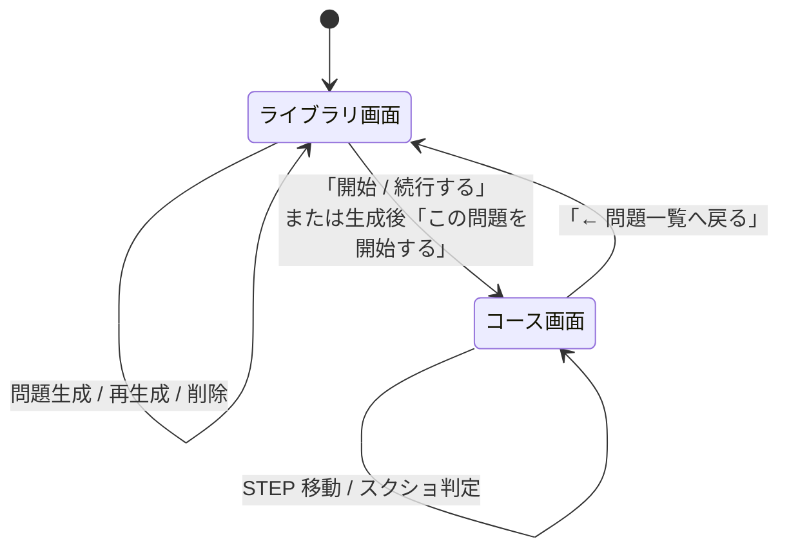

# 画面設計書 — STEP学習問題作成ツール

## 1. ドキュメントの位置づけ

本書は、本ツールのフロントエンド（`public/index.html` / `public/app.js` / `public/style.css`）の画面構成・項目・遷移・操作仕様を整理したものである。実装済みの仕様に基づく。

- 関連：[要件定義書.md](要件定義書.md) / [詳細設計書.md](詳細設計書.md) / [改修案.md](改修案.md)

---

## 2. 画面構成の全体方針

- フレームワーク不使用の素の HTML/CSS/JavaScript。
- 1 つの HTML 内に 2 つの `<main>` を持ち、`display` の切り替えで SPA 的に出し分ける。
  - `#library-screen`：ライブラリ（問題一覧）画面
  - `#course-screen`：コース（STEP 進行）画面
- ヘッダー（`<header>`）は両画面で共通表示。`#header-subtitle` にコース名を表示する。
- 状態はすべて `app.js` のトップレベル変数で保持し、サーバーとは API 経由で同期する。

### 2.1 画面一覧

| 画面 ID | 画面名 | 役割 |
| --- | --- | --- |
| `library-screen` | ライブラリ画面 | AI 選択 / コース一覧 / `.md` 読み込み・生成 |
| `course-screen` | コース画面 | STEP の GOAL・要件・チェックポイント表示と AI 判定 |

---

## 3. 画面遷移

- 初期表示はライブラリ画面（`init()` → `showLibraryScreen()`）。
- コース画面へはコース選択時のみ遷移。戻るとコースの選択状態はクリアされ一覧を再取得する。

---

## 4. 共通ヘッダー

| 要素 ID | 種別 | 内容 | 備考 |
| --- | --- | --- | --- |
| （`h1`） | 見出し | 「STEP学習」 | 固定 |
| `header-subtitle` | テキスト | `コースタイトル ／ サブタイトル` | コース画面で設定、ライブラリ戻り時に空 |

---

## 5. ライブラリ画面（`library-screen`）

3 つのパネル（`section.library-panel`）で構成する。

### 5.1 使用する AI パネル（`ai-provider-panel`）

| 要素 ID / name | 種別 | 内容・仕様 |
| --- | --- | --- |
| （`h2`） | 見出し | 「使用するAI」 |
| `ai-provider-options` | ラジオ群 | `name="ai-provider"`、値：`gemini` / `claude` / `openai` |
| `.ai-provider-model` | テキスト | 各ラジオ横にモデル名を `（モデル名）` 形式で表示 |
| `ai-provider-note` | テキスト | 未設定プロバイダーがある場合の注記 |

**仕様**

- 起動時に `GET /api/providers` を呼び、`available: false` のラジオを `disabled` にする。
- 選択値は `localStorage`（`stepTrainingAiProvider`）に保存し、再訪時に復元する。
- 選択に応じて生成ボタンの文言を「この問題を生成する（<AI名>）」に更新する。
- 取得失敗時は全プロバイダー選択可能のままにし、実リクエスト時のエラーに委ねる。

### 5.2 問題一覧パネル

| 要素 ID | 種別 | 内容・仕様 |
| --- | --- | --- |
| （`h2`） | 見出し | 「問題一覧」 |
| `course-list` | コンテナ | コースカードを描画。0 件時は案内文を表示 |

**コースカード（`.course-card`）の項目**

| 項目 | 内容 | 表示条件 |
| --- | --- | --- |
| タイトル（`.name`） | コース `title` | 常時 |
| サブ情報（`.sub`） | `subtitle ／ sourceFilename` | 常時（値があるもの） |
| 付帯情報（`.info`） | `生成日時：… ／ 使用AI：…` | `createdAt` / `aiModel` がある場合 |
| 「開始 / 続行する」 | コースを開く | 常時（全コース） |
| 「この問題を再生成」 | 再生成モードへ | 生成コースのみ（`builtin: false`） |
| 「削除」 | コース削除 | 生成コースのみ（`builtin: false`） |

- 組み込みコース（`builtin: true`）は再生成・削除ボタンを表示しない。
- 文字列は `escapeHtml()` で XSS 対策の上で描画する。

### 5.3 新しい問題(.md)を読み込むパネル

| 要素 ID | 種別 | 内容・仕様 |
| --- | --- | --- |
| `upload-heading` | 見出し | 通常「新しい問題(.md)を読み込む」／再生成時「「<コース名>」を再生成」 |
| `upload-target-note` | テキスト | 再生成時に進捗リセットの注意文を表示 |
| `md-file-input` | ファイル入力 | `accept=".md,text/markdown"` |
| `generate-button` | ボタン | 既定 `disabled`。`.md` 選択で有効化。文言に AI 名を含む |
| `cancel-regenerate-button` | ボタン | 再生成モード時のみ表示（キャンセル） |
| `generate-status` | テキスト | 生成中・成功・失敗のステータス表示（`ok`/`ng` クラス） |
| `generate-progress-list` | リスト | 生成段階の進捗（下記） |

**生成進捗リスト（`GENERATE_PROGRESS_STAGES`）**

| stage | 表示ラベル | 意味 |
| --- | --- | --- |
| `md_loaded` | mdデータの読み込み | `.md` 受領 |
| `ai_generated` | 問題作成 | AI 生成（最大 8 分、唯一時間がかかる段階） |
| `json_saved` | jsonファイルでの出力 | 教材ファイル保存・一覧更新完了 |

- 完了した段階の行に `done` クラスを付与する。
- 進捗は SSE（`GET /api/courses/generate-progress/:jobId`）で受信する。

#### 操作仕様（生成・再生成）

1. `.md` を選択すると `FileReader` で本文を読み込み生成ボタンを有効化。
2. 「生成する」押下で、再生成モードなら確認ダイアログ（「進捗がリセットされます。再生成してよろしいですか？」）を表示。
3. `jobId` を発行し SSE 接続 → `POST /api/courses/generate`（または `/:id/regenerate`）を実行。
4. 成功時：「「<タイトル>」を生成しました（タスク数：N）。」＋「この問題を開始する」ボタンを表示。
5. 失敗時：`エラー：<メッセージ>` または `通信エラー：…` を表示。
6. 完了後はファイル未選択状態に戻し生成ボタンを `disabled` に戻す。

---

## 6. コース画面（`course-screen`）

### 6.1 構成

| 要素 ID | 種別 | 内容 |
| --- | --- | --- |
| `back-to-library-button` | ボタン | 「← 問題一覧へ戻る」 |
| `step-nav` | ナビ | STEP ボタン一覧（左カラム） |
| `step-panel` | パネル | 選択中 STEP の内容（右カラム） |

レイアウトは `.course-body` 内で STEP ナビ（左）と STEP パネル（右）の 2 カラム。

### 6.2 STEP ナビゲーション（`step-nav`）

| 状態クラス | 意味 | 付与条件 |
| --- | --- | --- |
| `active` | 選択中 | 現在表示中の STEP |
| `passed` | 合格済み（✅） | 当該 STEP の全判定基準が合格（`passedStepIds`） |

- 各ボタンの文言は STEP の `title`。
- クリックで該当 STEP へ移動（`goTo`）。

### 6.3 STEP パネル（`step-panel`）

| 要素 ID | 種別 | 内容 |
| --- | --- | --- |
| `step-title` | 見出し | STEP の `title`（テキスト） |
| `step-goal` | ブロック | 「タスクの GOAL」見出し＋ `goalHtml`（`innerHTML`） |
| `step-detail` | ブロック | `detailHtml`（`innerHTML`） |
| `checkpoint-instruction` | テキスト | チェックポイントの `instruction` |
| `checkpoint-criteria` | リスト | 判定基準のチェックボックス一覧（下記） |
| `screenshot-input` | ファイル入力 | `accept="image/*" multiple` |
| `paste-area` | 領域 | フォーカス＋Ctrl+V で画像貼り付け |
| `preview` | コンテナ | 選択中画像のサムネイル（各々に削除 `×`） |
| `judge-button` | ボタン | 「スクリーンショットをAIに判定してもらう」 |
| `judge-result` | コンテナ | 判定結果（理由・項目別 ✅/❌） |
| `prev-button` / `next-button` | ボタン | 前/次の STEP へ（端で `disabled`） |

> `goalHtml` / `detailHtml` は AI 生成 HTML を `innerHTML` で描画する。XSS リスクは [改修案.md](改修案.md) を参照。

### 6.4 判定基準リスト（`checkpoint-criteria`）

- 各判定基準を `disabled` のチェックボックス＋ラベルで表示（手動チェック不可、表示専用）。
- チェック状態は `criteriaPassed[stepId]`（真偽配列、`criteria` の並び順に対応）を反映。

### 6.5 スクリーンショット提出

| 操作 | 挙動 |
| --- | --- |
| ファイル選択 | `onFileSelected` → `addFiles` で `selectedFiles` に追加 |
| Ctrl+V 貼り付け | `onPaste` → 画像 MIME のみ抽出して追加 |
| サムネイル `×` | `removeFile` で当該ファイルを除外 |
| STEP 切替時 | 選択ファイル・判定結果をリセット |

### 6.6 判定結果（`judge-result`）

| 状態クラス | 表示条件 | 内容 |
| --- | --- | --- |
| `ok` | 全項目合格 | 「今回の判定結果：全項目合格」 |
| `unknown` | 一部未合格 | 「今回の判定結果：一部未合格」 |
| `ng` | エラー | 「エラー：…」「通信エラー：…」「スクリーンショットを選択してください。」 |

- 結果は理由文（`reason`）＋項目別リスト（`✅`/`❌` ＋ 項目名）で表示する。
- 合格した項目のみ `criteriaPassed` を `true` に更新し、`POST /api/progress` で保存する。
- 判定後は選択ファイルをクリアする。

#### 操作仕様（判定）

1. 未合格の判定基準インデックスを集計（`pendingIndices`）。
2. すべて合格済みなら「すべて合格済みです」を表示して終了。
3. 画像未選択なら「スクリーンショットを選択してください。」を表示。
4. ボタンを `AIが判定中...` に変え `disabled` 化、`FormData` で `POST /api/judge`。
5. 応答の `checks` のうち `passed: true` の項目だけチェックを更新・保存。
6. 全項目合格になれば STEP ナビに ✅ を付ける。

---

## 7. 状態保持（フロント変数）

| 変数 | 内容 |
| --- | --- |
| `courseData` | 現在開いているコースの教材本体 |
| `currentCourseId` | 現在のコース ID |
| `currentIndex` | 表示中 STEP のインデックス |
| `selectedFiles` | 判定待ちのスクリーンショット（File[]） |
| `regenerateTargetId` | 再生成対象コース ID（null は新規生成） |
| `mdText` / `mdFilename` | 選択中 `.md` の本文・ファイル名 |
| `selectedAiProvider` | 選択中 AI プロバイダー |
| `providerModels` | `/api/providers` の取得結果 |
| `passedStepIds` | 全項目合格済み STEP の `id` 集合 |
| `criteriaPassed` | `{stepId: [bool,...]}` の判定基準合否 |

---

## 8. レスポンシブ・スタイル方針

- スタイルは `public/style.css` に集約（CSS フレームワーク不使用）。
- 状態表現はクラス（`ok`/`ng`/`unknown`/`active`/`passed`/`done`）で制御。

> 詳細なクラス・配色は `public/style.css` を参照。本書では画面項目と挙動の定義に主眼を置く。
