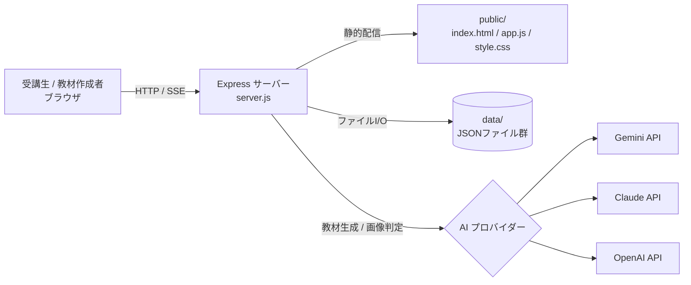

# 要件定義書 — STEP学習問題作成ツール

## 1. ドキュメントの位置づけ

本書は、個人開発で構築された「STEP学習問題作成ツール」（以下、本ツール）を、チーム開発・将来的なサービス化に向けて引き継ぐための要件定義書である。現状（実装済みの仕様）をベースに、機能要件・非機能要件・制約事項を整理する。

- 対象バージョン：`package.json` の `version: 0.1.0`
- 整理基準日：2026-06-30
- 関連ドキュメント：[画面設計書.md](画面設計書.md) / [詳細設計書.md](詳細設計書.md) / [改修案.md](改修案.md)

---

## 2. 背景・目的

### 2.1 背景

メンバーが自己学習で技術スキルを段階的（STEP型）に習得できるようにするために作成された社内ツールである。研修問題を Markdown（`.md`）で用意し、それを AI が「タスク単位の STEP 教材」に自動変換する。受講生は Web 画面でタスクを 1 つずつ進め、各タスクの達成証跡（AWS マネジメントコンソールや実装コードのスクリーンショット）をアップロードすると、AI が判定基準に沿って項目ごとに合否を自動判定する。

### 2.2 目的

- 受講生それぞれの技術レベル・必要スキルに合わせた学習を可能にする。
- 研修教材の作成コストを下げる（`.md` を渡すだけで STEP 教材が生成される）。
- 達成度の確認（採点）を AI で自動化し、講師の負荷を下げる。

### 2.3 本書作成の目的

個人開発からチーム開発へスケールするにあたり、暗黙知になっている現状仕様を明文化する。

---

## 3. 用語定義

| 用語 | 定義 |
| --- | --- |
| コース | 1 つの研修教材の単位。`title` / `subtitle` / `steps[]` を持つ。 |
| STEP（タスク） | コース内の 1 タスク。GOAL・要件（detail）・チェックポイントを持つ。 |
| チェックポイント | STEP の達成を確認する仕組み。判定基準（criteria）の集合。 |
| 判定基準（criteria） | スクリーンショットで合否判定する個別の確認項目（文）。 |
| 組み込みコース | 手作業で作成され保護された初期コース（`aws-level1-default`）。再生成・削除不可。 |
| 生成コース | `.md` から AI が生成したコース。再生成・削除が可能。 |
| AI プロバイダー | 教材生成・判定に使う AI。Gemini / Claude / OpenAI から選択。 |
| 進捗 | コースごと・STEP ごとの判定基準チェック状態（合否の真偽配列）。 |

---

## 4. 想定利用者（ロール）

| ロール | 説明 | 現状の権限分離 |
| --- | --- | --- |
| 受講生 | STEP を進め、スクリーンショットを提出して判定を受ける。 | なし（全員同一画面） |
| 教材作成者（講師） | `.md` を読み込ませてコースを生成・再生成・削除する。 | なし（同一画面で実施） |
| 運用者 | サーバーを起動し、`.env` に API キーを設定する。 | なし |

> 現状はログイン認証・ロール分離が存在せず、サーバーにアクセスできる全員が全機能を利用できる。サービス化時の重要な改修ポイント（[改修案.md](改修案.md) 参照）。

---

## 5. システム全体像



- フロントエンド：フレームワーク不使用の素の HTML/CSS/JavaScript（SPA 的に 2 画面を出し分け）。
- バックエンド：Node.js + Express。ルーティングとレスポンス整形のみを担い、ロジックは `lib/` に分割。
- データ永続化：DB 不使用。`data/` 配下の JSON ファイルを直接読み書き。
- AI 連携：Gemini / Claude / OpenAI の 3 プロバイダーに対応。モデルはコスト重視でコード側に固定。

---

## 6. 機能要件

### 6.1 機能一覧

| ID | 機能 | 概要 | 対応 API |
| --- | --- | --- | --- |
| F-01 | AI プロバイダー選択 | 利用可能な AI を選択。未設定キーのものは選択不可。 | `GET /api/providers` |
| F-02 | コース一覧表示 | 登録済みコースをカード形式で一覧表示。 | `GET /api/courses` |
| F-03 | コース生成 | `.md` を AI に渡し STEP 教材を新規生成。 | `POST /api/courses/generate` |
| F-04 | コース再生成 | 既存コースを別／修正版 `.md` で上書き生成。進捗リセット。 | `POST /api/courses/:id/regenerate` |
| F-05 | コース削除 | 生成コースと進捗を削除。 | `DELETE /api/courses/:id` |
| F-06 | 生成進捗通知 | 生成の段階（md読込/問題作成/json出力）を SSE で通知。 | `GET /api/courses/generate-progress/:jobId` |
| F-07 | コース教材取得 | STEP 画面表示用に教材本体を取得。 | `GET /api/courses/:id` |
| F-08 | STEP 進行表示 | STEP の GOAL・要件・チェックポイントを表示し移動。 | （フロント） |
| F-09 | スクリーンショット提出 | ファイル選択／Ctrl+V 貼り付けで画像を追加。 | （フロント） |
| F-10 | AI 判定 | 未合格の判定基準のみを対象に画像を AI 判定。 | `POST /api/judge` |
| F-11 | 進捗取得 | コースの判定基準チェック状態を取得。 | `GET /api/progress/:courseId` |
| F-12 | 進捗保存 | STEP の判定基準チェック状態を永続化。 | `POST /api/progress` |

### 6.2 機能詳細

#### F-01 AI プロバイダー選択

- サーバーは各プロバイダーの API キー設定状況（`available`）とモデル名（`model`）を返す。
- フロントは未設定（`available: false`）のプロバイダーをラジオボタンで選択不可にする。
- 選択結果は `localStorage`（キー：`stepTrainingAiProvider`）に保存し、教材生成・判定の双方で使い回す。
- 既定値は `gemini`。保存値が利用不可の場合は利用可能なものへフォールバック。

#### F-03 コース生成

- 入力：`.md` 本文（テキスト）、ファイル名、AI プロバイダー、`jobId`。
- 処理：プロンプト（変換ルール込み）＋ `.md` 本文を AI に送信 → JSON 抽出 → スキーマ検証 → 教材ファイル保存 → 一覧（`index.json`）へメタ情報追記。
- コース ID は `crypto.randomUUID()` で発行。
- 生成に成功するとタイトル・サブタイトル・STEP 数を返し、画面に「この問題を開始する」ボタンを表示する。
- 変換ルール（プロンプトで制御）の要点：
  - 教材の「タスク」「大見出し」単位を 1 STEP とする（STEP 数は可変）。
  - 各 STEP に GOAL・要件・判定基準を含め、判定基準はスクリーンショットで判定可能な具体文にする。
  - 説明文（なぜ・何をするか）を添えた文章問題として構成する。
  - ` ``` ` のコードブロックは改変・要約・分割せず原文のまま `<pre><code>` に転記し、改行は `\n` 等にエスケープする。
  - 注意点・ヒントセクションは判定基準に含めない。画像・リンクは無視しテキストのみで構成する。

#### F-04 コース再生成

- 組み込みコース（`builtin: true`）は再生成不可（400 を返す）。
- 同一 ID のファイルを上書きし、一覧メタ情報を最新化（`updatedAt` を付与）。
- 教材構成が変わるため、当該コースの進捗を空（`{}`）にリセットする。
- フロントは実行前に確認ダイアログ（「進捗がリセットされます」）を必ず表示する。

#### F-05 コース削除

- 組み込みコースは削除不可（400 を返す）。
- 教材本体ファイル・一覧エントリ・進捗データをまとめて削除する。
- フロントは実行前に確認ダイアログを表示する。

#### F-10 AI 判定

- 入力：`courseId`、`stepId`、判定対象の判定基準インデックス配列（`criteriaIndices`）、AI プロバイダー、スクリーンショット（最大 6 枚）。
- 未合格の判定基準だけを AI に送り、合格済みは再判定しない。
- 出力：`{ judgement: "OK"|"NG", reason, checks:[{index,item,passed}] }`。
- AI が一部項目の回答を返し忘れた場合は `passed: false` として補完する。
- 画像はディスクに保存せず、メモリ上で AI API への送信にのみ使用する。

#### F-12 進捗保存

- 保存形式：`{ [courseId]: { [stepId]: [true,false,...] } }`。
- 配列インデックスは当該 STEP の `checkpoint.criteria` の並び順に対応する。
- フロントは AI 判定が返るたびに、その時点の最新配列を送信する。

---

## 7. 画面要件（概要）

| 画面 | 役割 | 主な構成 |
| --- | --- | --- |
| ライブラリ画面 | コース一覧・AI 選択・`.md` 読み込み | AI 選択、問題一覧（カード）、新規読み込みフォーム、生成進捗リスト |
| コース画面 | STEP 進行・判定 | STEP ナビ、GOAL、要件、チェックポイント（判定基準・画像アップロード・判定結果）、前後移動 |

詳細は [画面設計書.md](画面設計書.md) を参照。

---

## 8. データ要件

| データ | 保存先 | 形式 | 備考 |
| --- | --- | --- | --- |
| 組み込みコース教材 | `data/steps.json` | コース JSON | 手作業作成・保護対象 |
| 生成コース教材 | `data/courses/<id>.json` | コース JSON | 1 ファイル 1 コース |
| コース一覧 | `data/courses/index.json` | メタ情報配列 | 教材本体は含まない |
| 進捗 | `data/progress.json` | `{courseId:{stepId:[bool]}}` | 旧フラット形式は自動移行 |
| デバッグ用 AI 応答 | `data/debug-last-course-response.<provider>.txt` | テキスト | 直前 1 回分のみ上書き |

データモデルの詳細は [詳細設計書.md](詳細設計書.md) を参照。

---

## 9. 外部インターフェース要件

| 連携先 | 用途 | モデル（固定） | 認証 |
| --- | --- | --- | --- |
| Google Gemini API | 教材生成・画像判定 | `gemini-2.5-flash-lite` | `GEMINI_API_KEY` |
| Anthropic Claude API | 教材生成・画像判定 | `claude-haiku-4-5` | `ANTHROPIC_API_KEY` |
| OpenAI API | 教材生成・画像判定 | `gpt-5-mini`（`reasoning_effort: minimal`） | `OPENAI_API_KEY` |

- モデルはコスト重視でコード側に固定しており、`.env` での切り替え項目はない。
- API キーは `.env` で設定。3 つのうち 1 つ以上の設定で動作する。

---

## 10. 非機能要件

### 10.1 性能・スケーラビリティ

| 項目 | 現状 | 備考 |
| --- | --- | --- |
| 想定同時利用 | 少人数（個人〜小チーム） | ローカル起動を前提 |
| コース生成時間 | 数十秒〜最大 8 分 | AI 呼び出しが 1 ワーカーを長時間占有 |
| アップロード上限 | 1 ファイル 8MB / 最大 6 枚 | `multer` 設定 |
| JSON ボディ上限 | 5MB | `.md` 本文送信用 |
| データ整合性 | 排他制御なし | 同時書き込みで後勝ち上書きのリスク |

> 複数プロセス・複数台構成では `data/` の JSON が共有されず不整合が起きる。スケール時は DB / オブジェクトストレージへの移行が前提（[改修案.md](改修案.md)）。

### 10.2 可用性・信頼性

- AI の一時的混雑（429/503/529 等）は指数バックオフで自動リトライ（生成は最大 4 回、判定は最大 2 回）。
- `insufficient_quota`（未払い・上限到達）はリトライせず即エラー化し、対処先を明示する。
- 出力上限超過でレスポンスが途中で切れた場合は専用エラーメッセージを返す。
- JSON 解釈失敗時は寛容パーサー（`tolerantJsonParse`）で救済を試みる。

### 10.3 セキュリティ

| 項目 | 現状 |
| --- | --- |
| 認証・認可 | なし（全機能が無認証で利用可能） |
| API キー管理 | `.env`（`.gitignore` で除外、リポジトリに含めない） |
| 画像の保存 | サーバーディスクに保存せずメモリ上で AI 送信のみ |
| XSS 対策 | フロントで `escapeHtml()` を使用。ただし AI 生成 HTML（`goalHtml`/`detailHtml`）は `innerHTML` で描画 |
| 通信 | HTTP（HTTPS 化はホスティング側に委譲） |

> AI が生成した HTML をそのまま `innerHTML` に挿入しており、悪意ある `.md` 入力による XSS リスクが残る。サービス化時の要対応（[改修案.md](改修案.md)）。

### 10.4 保守性・テスト

- ロジックは `lib/`（dataStore / aiProviders / courseGenerator / judge / jsonExtract / progressEvents）に分割。
- `server.js` / `public/app.js` 内のコメントで処理の流れと各関数の役割を説明（設計書代替の方針）。
- テスト：Jest による単体テスト（server / lib / frontend）と結合テスト（`test/integration/`）を用意。`npm test` で実行。
- カバレッジ対象：`server.js`、`lib/**/*.js`、`public/app.js`。

### 10.5 運用・移植性

- 動作環境：Node.js v18 以上を推奨。
- 起動：`npm install` → `.env` 設定 → `npm start` → `http://localhost:3000`。
- ポート：`PORT` 環境変数（既定 3000）。
- 結合テスト用に `STEP_TRAINING_DATA_DIR` でデータディレクトリを切り替え可能。

---

## 11. 制約事項・前提

- ローカル単一プロセスでの動作を前提とした設計（DB・認証・キュー未導入）。
- AI 出力には一定のブレがあり、再生成で結果が変わりうる（特に Claude/OpenAI は出力上限に当たりやすい）。
- 教材生成・判定はオンラインの外部 AI API に依存する（オフライン不可）。
- 利用には各 AI プロバイダーの API キー（Claude/OpenAI は原則として有償クレジット）が必要。

---

## 12. 既知のリスク（要改修ポイントの要約）

| リスク | 内容 | 詳細 |
| --- | --- | --- |
| 認証・認可なし | 誰でも全機能を利用可能 | [改修案.md](改修案.md) |
| データ競合 | JSON ファイルの read-modify-write に排他制御なし | [改修案.md](改修案.md) |
| スケール不可 | ローカル JSON 前提でマルチインスタンス不可 | [改修案.md](改修案.md) |
| 長時間処理の同期占有 | 生成 API が最大 8 分ワーカーを占有 | [改修案.md](改修案.md) |
| XSS | AI 生成 HTML を `innerHTML` で描画 | [改修案.md](改修案.md) |

外部サービス化に向けた具体的な改修方針は [改修案.md](改修案.md) に記載する。
