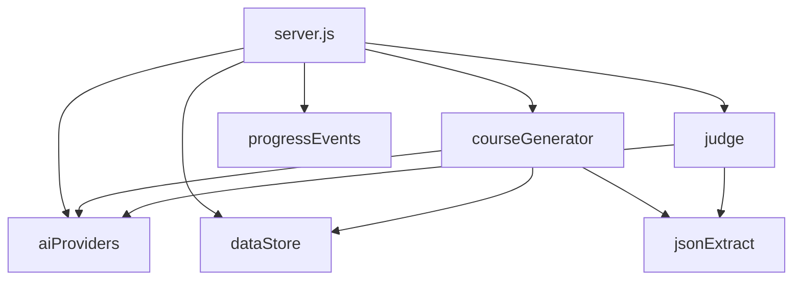
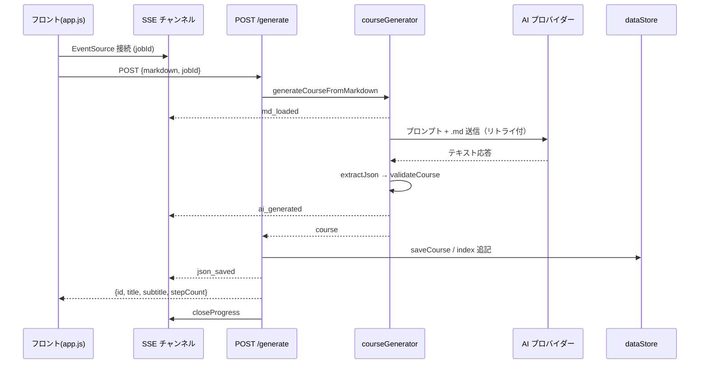
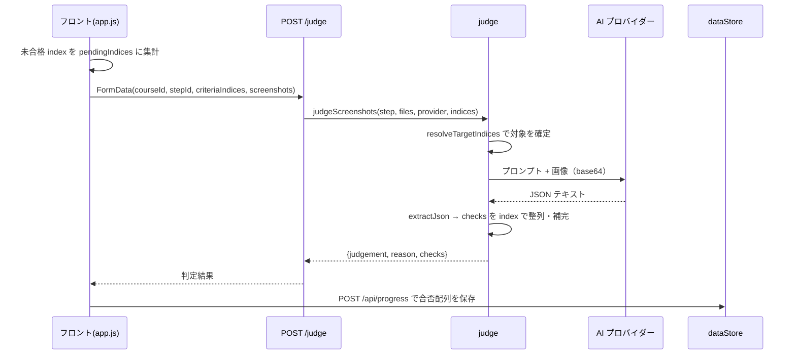

# 詳細設計書 — STEP学習問題作成ツール

## 1. ドキュメントの位置づけ

本書は、本ツールのバックエンド／フロントエンド実装の内部構造（モジュール構成・API 仕様・データモデル・主要処理フロー・エラー処理）を整理した詳細設計書である。実装済みコードに基づく。

- 関連：[要件定義書.md](要件定義書.md) / [画面設計書.md](画面設計書.md) / [改修案.md](改修案.md)

---

## 2. 技術スタック

| 区分 | 採用技術 |
| --- | --- |
| 実行環境 | Node.js（v18 以上推奨） |
| サーバー | Express 4 |
| アップロード | multer 2（メモリストレージ） |
| 環境変数 | dotenv |
| AI SDK | `@google/generative-ai` / `@anthropic-ai/sdk` / `openai` |
| フロント | 素の HTML / CSS / JavaScript（フレームワーク不使用） |
| テスト | Jest 30 / jest-environment-jsdom / supertest |
| 永続化 | ローカル JSON ファイル（DB 不使用） |

---

## 3. ディレクトリ・モジュール構成

```
step-training-app/
  server.js                 Express サーバー本体（ルーティング・I/O 整形のみ）
  lib/
    aiProviders.js          AI 共通下回り（クライアント初期化・リトライ・エラー整形）
    courseGenerator.js      問題生成（.md → 教材 JSON）
    judge.js                AI 判定（スクショ合否判定）
    jsonExtract.js          AI 応答からの JSON 抽出（寛容パーサー含む）
    dataStore.js            コース・進捗のファイル I/O
    progressEvents.js       生成進捗通知（SSE）
  public/
    index.html              2 画面のマークアップ
    app.js                  フロント全処理（状態管理・API 呼び出し）
    style.css               スタイル
  data/
    steps.json              組み込みコース教材（aws-level1-default）
    courses/index.json      生成コース一覧（メタ情報）
    courses/<id>.json       生成コース教材本体
    progress.json           進捗（コース×STEP の合否配列）
  test/                     単体・結合テスト
```

### 3.1 依存関係



- `server.js` はルーティングとリクエスト／レスポンス整形に専念。
- ビジネスロジックは `lib/` 配下に分離。
- テスト時（`require` 経由）は `app.listen` を行わず、supertest が `app` を直接利用する（`require.main === module` 判定）。

---

## 4. データモデル

### 4.1 コース（教材本体）

`data/steps.json` および `data/courses/<id>.json` の形式。

```jsonc
{
  "title": "string",        // 教材タイトル（必須・非空）
  "subtitle": "string",     // サブタイトル（必須・空文字可）
  "steps": [                // 1 件以上必須
    {
      "id": 1,              // number（必須）
      "title": "string",   // STEP タイトル（必須・非空）
      "goalHtml": "string",   // GOAL の HTML（必須）
      "detailHtml": "string", // 要件の HTML（必須）
      "checkpoint": {
        "instruction": "string",          // 必須
        "criteria": ["string", "..."]     // 1 件以上必須
      }
    }
  ]
}
```

スキーマ検証は `courseGenerator.validateCourse()` が担い、不正時は理由付きで例外を投げる。

### 4.2 コース一覧（メタ情報）

`data/courses/index.json` は以下の要素の配列。

```jsonc
{
  "id": "uuid",
  "title": "string",
  "subtitle": "string",
  "sourceFilename": "string",
  "createdAt": "ISO8601",
  "updatedAt": "ISO8601",   // 再生成時に付与
  "aiProvider": "gemini|claude|openai",
  "aiModel": "string",
  "builtin": false
}
```

### 4.3 進捗

`data/progress.json` の形式。

```jsonc
{
  "<courseId>": {
    "<stepId>": [true, false, true]   // criteria の並び順に対応する合否配列
  }
}
```

- 旧フラット形式（`{stepId: [...]}`）は読み込み時に組み込みコース名前空間へ自動移行する。

---

## 5. バックエンド API 仕様

ベース：Express。`express.json({ limit: "5mb" })` と `express.static("public")` を適用。

### 5.1 プロバイダー情報

#### `GET /api/providers`

- レスポンス：

```json
{
  "gemini": { "available": true, "model": "gemini-2.5-flash-lite" },
  "claude": { "available": false, "model": "claude-haiku-4-5" },
  "openai": { "available": false, "model": "gpt-5-mini" }
}
```

- `available` は対応する SDK クライアントが初期化済み（API キー設定済み）かどうか。

### 5.2 コース API

#### `GET /api/courses`

- 一覧（`index.json`）をそのまま返す。

#### `GET /api/courses/:id`

- 教材本体を返す。存在しなければ `404 {error}`。

#### `POST /api/courses/generate`

- リクエスト：`{ markdown, filename, aiProvider, jobId }`
- 検証：`markdown` が空文字／非文字列なら `400`。
- 処理：
  1. `resolveProvider` でプロバイダー確定（不正値は `gemini`）。
  2. `generateCourseFromMarkdown` で教材 JSON 生成（進捗 `md_loaded`→`ai_generated`）。
  3. `crypto.randomUUID()` で ID 発行、`saveCourse` で保存。
  4. `index.json` にメタ情報 push、`saveCourseIndex`。進捗 `json_saved`。
- レスポンス：`{ id, title, subtitle, stepCount }`。
- 失敗：`500 {error: "コースの生成に失敗しました: " + describeProviderError(err)}`。
- `finally` で `closeProgress(jobId)`。

> 注意：`loadCourseIndex → push → saveCourseIndex` は排他制御なし（read-modify-write 競合のリスク）。

#### `POST /api/courses/:id/regenerate`

- リクエスト：`{ markdown, filename, aiProvider, jobId }`
- 検証：対象不在 `404` / 組み込みコース `400` / `markdown` 空 `400`。
- 処理：教材を上書き保存、メタ情報更新（`updatedAt` 付与）、当該コースの進捗を `{}` にリセット。
- レスポンス：`{ id, title, subtitle, stepCount }`。

#### `DELETE /api/courses/:id`

- 検証：対象不在 `404` / 組み込みコース `400`。
- 処理：一覧から除外、教材ファイル削除（無ければ無視）、進捗から削除。
- レスポンス：`{ ok: true }`。

#### `GET /api/courses/generate-progress/:jobId`（SSE）

- `text/event-stream` を返す進捗通知チャンネル。
- 接続時に `:ok` コメントを送り、`job.history` の既送信段階を即時リプレイ。
- `req.on("close")` でクライアントを解除。

### 5.3 進捗 API

#### `GET /api/progress/:courseId`

- 当該コースの進捗（`{stepId:[bool]}`）を返す。無ければ `{}`。

#### `POST /api/progress`

- リクエスト：`{ courseId, stepId, criteria }`
- 検証：`courseId` 文字列・`stepId` 整数・`criteria` 配列でなければ `400`。
- 処理：`progress[courseId][stepId] = criteria` を保存。
- レスポンス：`{ ok: true }`。

### 5.4 判定 API

#### `POST /api/judge`

- 形式：`multipart/form-data`。`upload.array("screenshots", 6)`（最大 6 枚・各 8MB）。
- フィールド：`courseId`、`stepId`、`criteriaIndices`（JSON 文字列の配列）、`aiProvider`、`screenshots`。
- 検証：
  - コース／STEP 不在 → `400`。
  - 画像 0 枚 → `400`。
  - プロバイダー未設定 → `500 {error: "<ENV_VAR> が設定されていません…"}`。
- 処理：`judgeScreenshots(step, files, provider, criteriaIndices)` を実行。
- レスポンス：`{ judgement, reason, checks: [{index,item,passed}] }`。
- 失敗：`500 {error: "<Label> API の呼び出しに失敗しました: " + describeProviderError(err)}`。

---

## 6. 主要処理フロー

### 6.1 コース生成シーケンス



### 6.2 AI 判定シーケンス



---

## 7. モジュール詳細

### 7.1 `lib/aiProviders.js`

| エクスポート | 役割 |
| --- | --- |
| `genAI` / `anthropic` / `openai` | 各 SDK クライアント（API キー未設定なら `null`） |
| `GEMINI_MODEL` / `CLAUDE_MODEL` / `OPENAI_MODEL` | 固定モデル名 |
| `PROVIDER_ENV_VAR` / `PROVIDER_LABEL` / `PROVIDER_MODEL` | プロバイダー別の対応表 |
| `resolveProvider(value)` | `claude`/`openai` 以外は `gemini` にフォールバック |
| `isProviderAvailable(provider)` | クライアント初期化済みか判定 |
| `withRetry(fn, maxRetries, baseDelayMs)` | 一時エラーのみ指数バックオフでリトライ |
| `claudeText(message)` | Claude 応答からテキスト連結 |
| `describeProviderError(err)` | エラー文言を補強（`insufficient_quota` の対処明示） |
| `throwIfTruncated(isTruncated)` | 出力上限切れ時に専用エラーを投げる |

**固定モデル**：`gemini-2.5-flash-lite` / `claude-haiku-4-5` / `gpt-5-mini`。OpenAI SDK は `maxRetries: 0`（アプリ側 `withRetry` と二重化を避ける）。

**`withRetry` のリトライ判定**：

- リトライ対象：`500|503|429|529|UNAVAILABLE|RESOURCE_EXHAUSTED|overloaded` を含むメッセージ。
- 除外（永続エラー）：`insufficient_quota`（`err.code`/`err.type`）。
- 待機時間：`baseDelayMs * (attempt + 1)`。

### 7.2 `lib/courseGenerator.js`

| エクスポート | 役割 |
| --- | --- |
| `COURSE_GENERATION_MAX_TOKENS` | 出力上限（50000） |
| `COURSE_GENERATION_TIMEOUT_MS` | タイムアウト（8 分） |
| `validateCourse(course)` | 教材 JSON のスキーマ検証 |
| `generateCourseFromMarkdown(markdown, aiProvider, onProgress)` | 生成本体 |

- 内部 `getCourseGenerationText` でプロバイダー別の呼び出しを分岐（Claude は `stream().finalMessage()`、OpenAI は `chat.completions` + `reasoning_effort: minimal`、Gemini は `generateContent`）。生成は `withRetry(fn, 4, 3000)`。
- プロンプトに「変換ルール」「出力形式（JSON サンプル）」「教材本文」を連結。
- 生成テキストは `saveDebugAiResponse` で `data/debug-last-course-response.<provider>.txt` に上書き保存。
- `extractJson` → `validateCourse` の順で検証。

### 7.3 `lib/judge.js`

| エクスポート | 役割 |
| --- | --- |
| `getJudgeResponseText(provider, prompt, files)` | プロバイダー別に画像付きで判定応答を取得 |
| `judgeScreenshots(step, files, provider, criteriaIndicesRaw)` | 判定本体 |

- `resolveTargetIndices` で対象判定基準を確定（不正・未指定は全項目）。
- プロンプトに判定基準（`index. 文`）を列挙し、`{reason, checks:[{index,item,passed}]}` を要求。
- 画像は base64 化して送信（Claude=`image`/OpenAI=`image_url`/Gemini=`inlineData`）。`max_tokens` 2048。
- JSON 解釈失敗時は原文を `reason` に入れ NG 扱いで継続。
- AI の回答漏れ項目は `passed: false` で補完。全項目合格で `judgement: "OK"`。

### 7.4 `lib/jsonExtract.js`

| エクスポート | 役割 |
| --- | --- |
| `escapeControlCharsInJsonStrings(text)` | 文字列リテラル内の生制御文字を `\n` 等へ |
| `tolerantJsonParse(text)` | バックトラック式の寛容パーサー（未エスケープ `"` 救済） |
| `extractJson(text)` | コードブロック記号除去 → `JSON.parse` → 失敗時 `tolerantJsonParse` |

- `tolerantJsonParse` は最大試行 `MAX_ATTEMPTS = 200000`、CPS（継続渡し）スタイルで `parseValue/parseString/parseObjectMembers/parseArrayMembers` を実装。

### 7.5 `lib/dataStore.js`

| エクスポート | 役割 |
| --- | --- |
| `DATA_DIR` / `COURSES_DIR` / `COURSE_INDEX_PATH` / `PROGRESS_PATH` | パス定義 |
| `DEFAULT_COURSE_ID` / `DEFAULT_COURSE_PATH` | 組み込みコースの ID・パス |
| `loadCourseIndex` / `saveCourseIndex` | 一覧 I/O（壊れ時は空配列） |
| `courseFilePath(id)` | 組み込みは `steps.json`、他は `courses/<id>.json` |
| `loadCourse` / `saveCourse` | 教材本体 I/O |
| `loadProgress` / `saveProgress` | 進捗 I/O（旧形式の自動移行あり） |

- `DATA_DIR` は `STEP_TRAINING_DATA_DIR` で上書き可能（結合テスト用）。
- いずれも排他制御なし（同時書き込みで後勝ち）。

### 7.6 `lib/progressEvents.js`

| エクスポート | 役割 |
| --- | --- |
| `getOrCreateProgressJob(jobId)` | `{clients:Set, history:[]}` を取得／生成 |
| `sendProgress(jobId, stage)` | 全クライアントへ送信し `history` に積む |
| `closeProgress(jobId)` | 接続を閉じ Map から削除 |

- `progressJobs`（Map）でジョブを管理。`jobId` 未指定時は副作用なし。
- SSE 接続と POST の競合に備え、`history` で既送信段階をリプレイ可能にしている。

### 7.7 `public/app.js`（フロント）

主な関数：`init` / `initAiProviderSelector` / `selectAiProvider` / `showLibraryScreen` / `loadCourseList` / `renderCourseList` / `startRegenerate` / `cancelRegenerate` / `deleteCourse` / `onMdFileSelected` / `onGenerateClick` / `openCourse` / `renderNav` / `updateNavState` / `goTo` / `renderStep` / `renderCriteria` / `onFileSelected` / `onPaste` / `addFiles` / `removeFile` / `renderPreview` / `onJudgeClick` / `persistProgress` / `formatDateTime` / `escapeHtml`。

役割・状態変数は [画面設計書.md](画面設計書.md) を参照。

---

## 8. エラー処理・メッセージ設計

| 状況 | 検出箇所 | ユーザー向けメッセージ（趣旨） |
| --- | --- | --- |
| API キー未設定 | `generateCourseFromMarkdown` / `/judge` | `<ENV_VAR> が設定されていません（.env を確認してください）` |
| 利用上限・未払い | `describeProviderError` | `insufficient_quota`（利用上限に達しています）を付記 |
| 一時混雑（429/503/529） | `withRetry` | 自動リトライ。最終失敗時はそのまま例外 |
| 出力上限切れ | `throwIfTruncated` | `AIの応答が出力上限に達し、途中で切れました…` |
| JSON 解釈不能（生成） | `generateCourseFromMarkdown` | `AIの出力をJSONとして解釈できませんでした: …` |
| JSON 解釈不能（判定） | `judgeScreenshots` | 原文を `reason` に入れ NG 扱いで継続 |
| 不正リクエスト | 各エンドポイント | `400` と理由メッセージ |

---

## 9. 設定・環境変数

| 変数 | 用途 | 既定 |
| --- | --- | --- |
| `GEMINI_API_KEY` | Gemini 認証 | なし |
| `ANTHROPIC_API_KEY` | Claude 認証 | なし |
| `OPENAI_API_KEY` | OpenAI 認証 | なし |
| `PORT` | 待受ポート | 3000 |
| `STEP_TRAINING_DATA_DIR` | データ保存先の切替（テスト用） | `./data` |

---

## 10. テスト構成

| 種別 | 場所 | 環境 |
| --- | --- | --- |
| サーバー単体 | `test/server*.test.js` | node |
| ライブラリ単体 | `test/lib/**/*.test.js` | node |
| フロント単体 | `test/app.test.js` | jsdom |
| 結合テスト | `test/integration/`（`jest.config.js`） | node（supertest） |

- 実行：`npm test` / カバレッジ `npm run test:coverage` / 結合 `npm run test:integration`。
- カバレッジ対象：`server.js` / `lib/**/*.js` / `public/app.js`。

---

## 11. 既知の技術的負債

- `data/` の JSON 直接 I/O は排他制御がなく、同時アクセスで競合する。
- 生成 API は AI 呼び出し（最大 8 分）で 1 ワーカーを同期占有する。
- 認証・認可が存在しない。
- AI 生成 HTML を `innerHTML` で描画している（XSS リスク）。

具体的な解消方針は [改修案.md](改修案.md) を参照。
